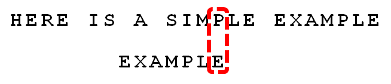
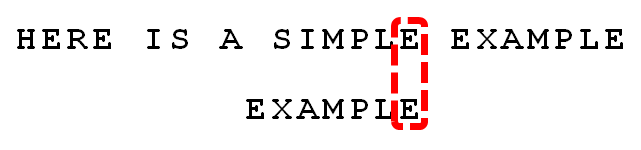

# Boyer-Moore

要匹配的字符叫做pattern，查找的文本叫做text，比如在HERE IS A SIMPLE EXAMPLE中查找EXAMPLE，pattern为EXAMPLE， text为HERE IS A SIMPLE EXAMPLE

1.首先构建一张right表，这个表存储了在pattern中每个字母出现的最右的位置。比如example，


| e    | x    | a    | m    | p    | l    |
| ---- | ---- | ---- | ---- | ---- | ---- |
| 6    | 1    | 2    | 3    | 4    | 5    |
比如needle
| n    | e    | d    | l    |
| ---- | ---- | ---- | ---- |
| 0    | 5    | 3    | 4    |

这个表在查找时发生不匹配时使用。

2.匹配过程


首先从pattern的末尾开始比较，发现e和s不匹配，并且s没有在pattern中出现过，因此直接把pattern的开头移动到s后一个字符。



然后再从末尾开始比较，发现p和e仍然不匹配，但是p在pattern中出现过。需要把pattern最右边的p和text中的p对应的位置。查刚才构建的right表，right["p"]的值为4，移动步数计算方法为：pattern中当前的index(j=6)，减去right["p"], 即6-4=2，因此把pattern向右移动2步。


然后再从pattern的最后一个字符开始检查。




发现在pattern中index为2位置的字符和text中不匹配，并且text中不匹配的字符i不在pattern中，把pattern移动到i后面那一位。([这个移动可以更优化](http://www.ruanyifeng.com/blog/2013/05/boyer-moore_string_search_algorithm.html))


(*图片是错的，应该把e和p对齐)

然后再比较，pattern中e和a不匹配，a在pattern中出现过，right["a"] = 2,因此移动6-2=4步。


再从最后一个字符比较，发现全部都匹配，此时返回text中的下标。

程序：最坏情况比较N/M次

```python
def strStr(haystack, needle):
    if not haystack and not needle:
        return 0
    if not needle:
        return 0
    n = len(haystack)
    m = len(needle)
    right = {}
    for i in range(len(needle)):
        right[needle[i]] = i
    i = 0
    while i <= n - m:
        skip = 0
        j = m - 1
        while j >= 0:
            if haystack[i+j] != needle[j]:
                # 如果字符不在pattern中出现，移动到下一个字符的位置，因此没出现的字符为-1
                skip_buf = right.get(haystack[i+j], -1)
                skip = j - skip_buf
                # 每次保证至少移动1步
                if skip < 1:
                    skip = 1
                break
            j -= 1
        if skip == 0:
            return i
        i += skip
    return -1
```


| 算法          | 版本       | 操作次数(最坏/一般) | 在文本中回退 | 正确性  | 空间需求 |
| :---------- | -------- | :---------- | ------ | ---- | ---- |
| 暴力          | -        | MN/1.1N     | 是      | 是    | 1    |
| KMP         | 完整DFA    | 2N/1.1N     | 否      | 是    | MR   |
| KMP         | 仅构造不匹配状态 | 3N/1.1N     | 否      | 是    | M    |
| KMP         | 完整版本     | 3N/ N/M     | 是      | 是    | R    |
| Boyer-Moore | -        | MN/ N/M     | 是      | 是    | R    |
| Rabin-Karp  | 蒙特卡洛     | 7N/7N       | 否      | 概率保证 | 1    |
| Rabin-Karp  | 拉斯维加斯    | 7N/7N       | 是      | 是    | 1    |
|             |          |             |        |      |      |


